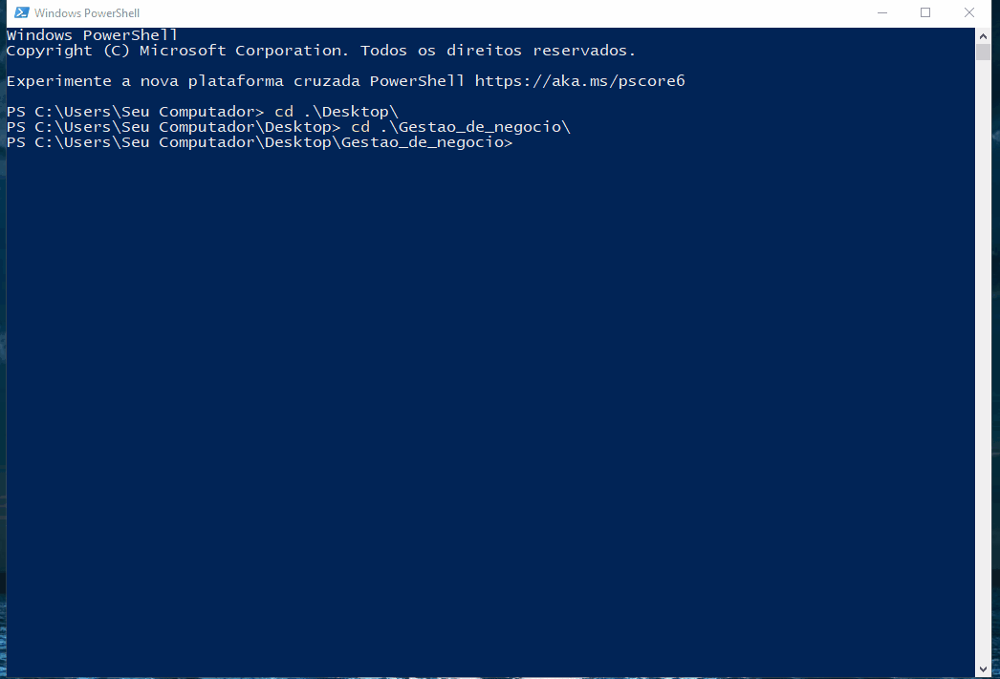

# 🚀 Projeto Gestão de Negócio: Engenharia de Prompt

Sistema de gestão modular PDV (Ponto de Venda) iniciado para o estudo aprofundado de bancos de dados SQL Relacional com Python, evoluindo para uma estrutura robusta de DevOps e conteinerização.

O projeto utiliza o Google Gemini como copiloto de engenharia para aplicar boas práticas de arquitetura e código limpo.

🛠️ Evolução Técnica
Fase 1 (Dados): Entendimento de dados relacionais, queries SQL e integração com Python.

Fase 2 (Infraestrutura): Introdução de conceitos DevOps, conteinerização com Docker, automação no WSL2 e uso de ferramentas como DB Browser for SQLite.

🏗️ Diferenciais do Sistema
Performance: SQLite3 com modo WAL (Write-Ahead Logging), garantindo um sistema fluido e pronto para acessos simultâneos.

Modularidade: Módulos independentes e distintos que permitem atualizações isoladas.

Persistência: Orquestração via Docker Compose com uso estratégico de volumes para que os dados sobrevivam ao ciclo de vida dos containers.

📊 Estrutura do Banco de Dados
Tabelas principais e suas conexões relacionais:

usuarios: Controle de acesso e níveis de cargo.

clientes: Cadastro detalhado (nome, empresa, contato).

produtos: Gestão de estoque com cálculos automáticos de preço por unidade e caixa.

pedidos: Registro de vendas vinculado a clientes e vendedores via Foreign Keys.

logs_sistema: Trilha de auditoria para todas as ações críticas (Segurança).

🧩 Módulos do Sistema
Módulo de Clientes: Fluxo inteligente para iniciar pedidos imediatamente após o cadastro ou consulta.

Gestão de Estoque: Funções de entrada/edição e saídas manuais com registro de motivo (ex: quebra ou devolução).

Sistema de Pedidos (PDV): Carrinho de compras temporário com validação de estoque em tempo real antes da persistência final.

Segurança e Auditoria: Login por camadas e registro automático de logs para cada movimentação.

🛡️ Boas Práticas Implementadas
Segurança de Dados: Configuração de .gitignore e .dockerignore para proteção de arquivos sensíveis e cache.

Persistência: Dados armazenados em volumes Docker para garantir integridade.

Resiliência: Tratamento de exceções com blocos try/finally para evitar travamentos de banco (database locks).

🚀 Como Executar
Pré-requisitos
Docker

Docker Compose

Passo a Passo
Clonar o repositório:

git clone https://github.com/seu-usuario/gestao-de-negocio-engenharia-prompt.git
cd gestao-de-negocio-engenharia-prompt
Subir o ambiente:

docker-compose up --build
O comando --build garante que qualquer alteração no código seja aplicada à imagem.

Acesso ao Sistema:

Usuário Padrão: admin

Senha Padrão: admin123

Nota: Os arquivos de dados são gerados automaticamente. Para resetar o sistema, basta excluir o arquivo .db; ele será recriado do zero na próxima execução.

Desenvolvido por Ariel Santos Costa Focado em constante evolução e engenharia de software de alta performance.